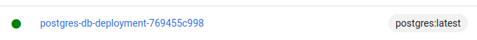

# Debt Manager

A aplicação simula uma aplicação em produção com n réplicas
capazes de receber requisições de criação de dívida, listagem,
busca por dívida específica e alteração de dívida.

O Debt Manager testa várias tecnologias interessantes:
* Cluster Kubernetes usando Minikube e Kubectl
* Banco de Dados Postgres

## Como executar

### Aplicação
* Faça o build da aplicação, no terminal, execute `./gradlew clean build -x test`
### Docker
* [Instale o docker](https://docs.docker.com/engine/install/ubuntu/)
### Kubernetes
1. [Instale o kubectl](https://kubernetes.io/docs/tasks/tools/install-kubectl-linux/)
1. [Instale o minikube](https://minikube.sigs.k8s.io/docs/start/)
1. **Inicialize Minikube:** no terminal, execute `minkube start`
1. **Abra o dashboard:** torne sua vida mais fácil, execute, no terminal `minikube dashboard`
1. **Dando acesso a imagens locais:** para que o minikube consiga carregar imagens do docker local, execute o comando `eval $(minikube docker-env)`
1. **Crie a imagem da aplicação:** `docker build . -t leandro\debt-manager:v1`
1. **Rodando o serviço de banco de dados:** execute, no terminal, `kubectl apply -f deploy/db-deployment.yaml`
   * **Aguarde a aplicação ficar estável no cluster:** Abra o dashboard e veja o status do serviço de banco de dados
   
1. **Rodando a aplicação debt manager:** execute, no terminal, `kubectl apply -f deploy/deployment.yaml`
1. **Exponha a porta para o serviço:** execute o comando `kubectl expose deployment debt-manager --type=NodePort --port=8080`
1. **Obtenha o ip do container da aplicação:** Execute o comando `minkube service debt-manager`. Esse comando 
irá fornecer o ip do container e a porta mapeada para a `8080` da aplicação.
1. **Finalizando a aplicação e removendo os recursos:** Execute `minikube delete --all`
